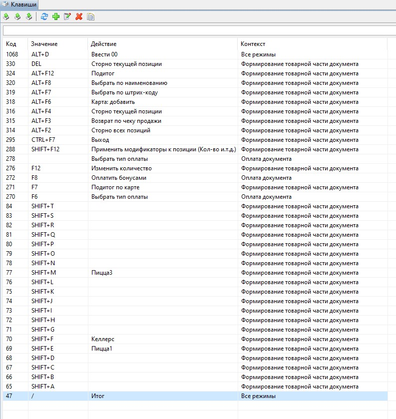

Дополнительные материалы:
-------------------------

1. Список директорий и файлов  основных настроек.
"""""""""""""""""""""""""""""""""""""""""""""""""

#. /linuxcash/cash/conf/
	#) ncash.ini - основной файл настроек
	#) bcode.ini  - правила разбора ШК
	#) frinit.conf - инициализация ФР
	#) cliche.txt и tail.txt - Клише/подвал чека
	#) artixsb.conf

#. /linuxcash/cash/conf/ncash.ini.d/
	#) artixbonus.ini - работа с бонусным сервером
	#) artixcertificate.ini
	#) deferredcheck.ini - отложенные чеки
	#) fr.ini
	#) gui.ini - выбор интерфейса ПО
	#) motp.ini - сигареты
	#) markedgoods.ini - другая маркировка
	   
#. /linuxcash/cash/conf/drivers/ - Настройки подключения оборудования

Сначала настраивается одна ПОС, полученные настройки используем как эталонные. После установки ПО на новую ПОС копируем настройки,
включая “Подключаемое оборудование”, проверяем и при необходимости вносим правки.

2. Особенности настройки “Сбербанк”	   
"""""""""""""""""""""""""""""""""""

Для работы с процессингом сбербанк необходимо установить пакет - *artix45-plugin-sb*.
В директорию **”/linuxcash/cash/paysystems/sb/“** разместить файлы приложения сбербанк полученного от сотрудников банка. Настроить подключение ПинПад согласно инструкции банка (pinpad.ini). Следует обратить внимание что при подключении пинпад через USB, необходимо правильно создать символьную ссылку на устройство:

::

	ln -s /dev/serial/by-id/{Имя_Устройства} /linuxcash/cash/paysystems/sb/ttyS99

Для работы с терминалом PAX SP30 - дополнительно установить пакет *ttypos*

3. Ссылка на скачивание дистрибутива yuki
"""""""""""""""""""""""""""""""""""""""""	
	http://update.artix.su/static/yuki/ 
	

4. Остатки
""""""""""

в конфигурационном файле /linuxcash/cash/conf/ncash.ini
Изменить:

::

	;calculateRemainsOfGoods = false
	.....
	;considerRemainsOfGoods = false

на:

::

	calculateRemainsOfGoods = true
	.....
	considerRemainsOfGoods = true

После изменения настроек надо перезапустить кассовое По.
Тогда касса будет считать остатки и учитывать их при продажи

Для товара, у которого не нужно контролировать остатки (кулинария) при выгрузке не указываем дату остатков - *remaindate*, а поле *remain* 
оставляем **пустым!!!** (не "0"!!!).

5. Дисконтные карты (создание)
""""""""""""""""""""""""""""""

	1. создать счет на бонусном сервере
	2. привязать номер карты к счету
	3. создать карту на кассовом сервере (группа должна быть создана заранее)

	1 и 2 это работа с апи бонусного сервера

	3 это работа с файлом аиф, или через рестапи загрузки справочников с Кассовым севером.

	https://docs.artix.su/pages/viewpage.action?pageId=27530936

6. Настройка действий и контекста клавиш
""""""""""""""""""""""""""""""""""""""""

