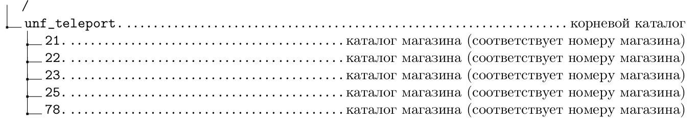

Общее описание
==============

Документация по блоку обмена между Artix и УНФ в части выгрузки остатков из УНФ в кассовый сервер Artix и загрузки кассовых смен и продаж в УНФ.
""""""""""""""""""""""""""""""""""""""""""""""""""""""""""""""""""""""""""""""""""""""""""""""""""""""""""""""""""""""""""""""""""""""""""""""""

Связь между 1С и Artix осуществляется с помощью Http-сервисов реализованных на стороне УНФ. Данные по продажам 1С забирает из базы данных
Кассового сервера с помощью Sql запросов. Таблицы из БД Кассового сервера подключены в УНФ в качестве внешнего источника данных.
Прокси сервер реализован на Python и располагается на отдельном сервере с Linux. 

.. figure:: images/gl.png

Работа происходит следующим образом:
В УНФ в справочнике "крю_Настройки" в предопределенном реквизите "КаталогКонтроляОбменаArtix" хранится путь до каталога интеграции
с Artix, который имеет следующую структуру - 

При проведении документа товародвижения срабатывает подписка на событие и в каталоге соответствующем номеру магазина создается файл-флаг
вида:  "1681466893_chg", где число это псевдослучайное число образованное разностью дат, для достижения уникальности имени файла.

Далле программа прокси с указанной настройкой сервера переодичнойстью отправляет запрос ("GetChangeShop") в УНФ для получения номеров магазинов по которым были изменения остатков в ту 
или иную сторону. УНФ "просматривает" каталоги в папке интеграции и возвращает список номеров магазинов в каталогах которых, были обнаружены
файлы флаги.

.. todo:: Fix this