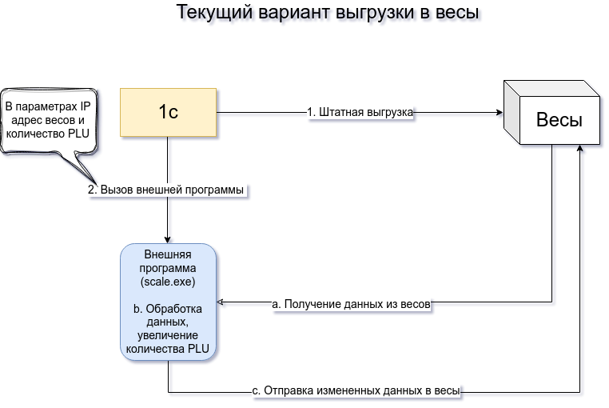
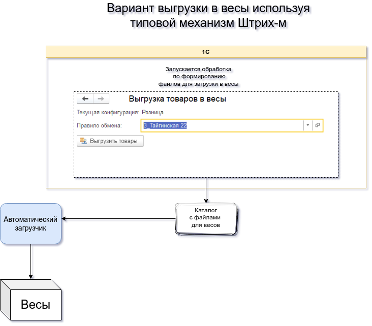
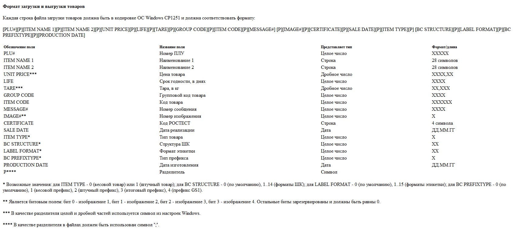
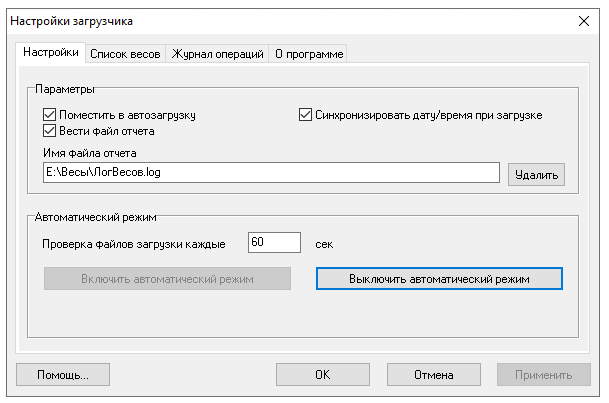
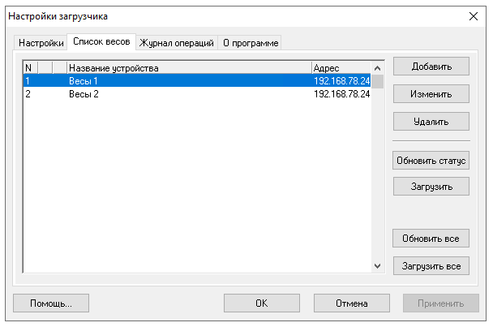
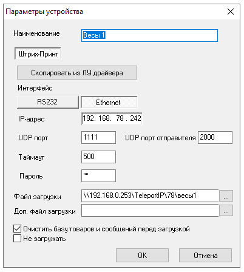

Работа с весами
===============

------

Пример файла выгрузки формируемый из 1С

.. code-block:: Python

    82;Шейки цыплят в/к;;550;0;0;0;10007;0;0;0;01.01.01;0;0;0;0;01.01.01
    2082;Шейки цыплят в/к;;550;0;0.006;0;10007;0;0;0;01.01.01;0;0;0;0;01.01.01
    3082;Шейки цыплят в/к;;550;0;0.008;0;10007;0;0;0;01.01.01;0;0;0;0;01.01.01
    4082;Шейки цыплят в/к;;550;0;0.012;0;10007;0;0;0;01.01.01;0;0;0;0;01.01.01
    5082;Шейки цыплят в/к;;550;0;0.02;0;10007;0;0;0;01.01.01;0;0;0;0;01.01.01
    6082;Шейки цыплят в/к;;550;0;0.014;0;10007;0;0;0;01.01.01;0;0;0;0;01.01.01

    

.. rubric:: 
    Настройка автоматического загрузчика      

*Указываем путь до файлов лога, включаем автоматический режим и устанавливаем интервал запуска.*

*Формируем список весов для загрузки*

*Настройка весов*

.. rubric:: 
    Настройка весов

Необходимо в весах установить префикс весового товара в **"20"**.

.. rubric::
    Настройки штрихкодирования на весах:

Правила разбора штрих-кода фиксируются в конфигурационном файле `/linuxcash/cash/conf/bcode.ini`
и применяются в заданном порядке. Также осуществляется считывание конфигурации bcodeparser из директории
`/linuxcash/cash/conf/bcode.ini.d/` (считывание файлов происходит в алфавитном порядке).
Итоговая конфигурация выводится в основной лог программы `/linuxcash/logs/current/terminal.log.`

.. attention::

    При указании правил разбора штрих-кода в конфигурационном файле `/linuxcash/cash/conf/bcode.ini`
    и в файлах директории `/linuxcash/cash/conf/bcode.ini.d/` 
    сначала происходит считывание файла `/linuxcash/cash/conf/bcode.ini.`

Ссылка на сайт с документацией_ (рус.)

.. _документацией: https://docs.artix.su/pages/viewpage.action?pageId=27532556
