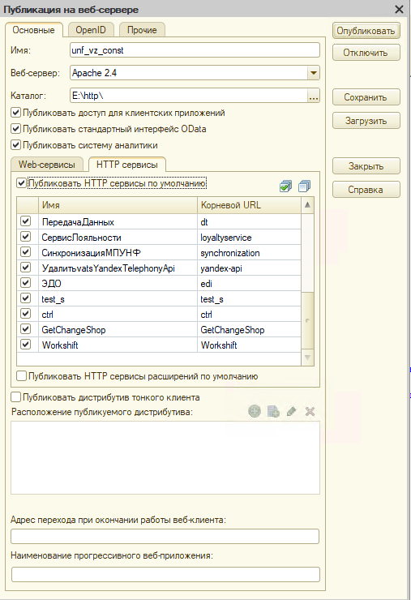

Реализация в УНФ
================

Функционал работы с Artix со стороны УНФ реализован с помощью:

#. Подписки на события для документов товародвижения:

     #) Поступление товаров 
     #) Списание товаров 
     #) Оприходование товаров 
     #) Перемещение товаров ?
     #) Возврат товаров поставщику
     #) Отчет о розничных продажах ?
     
#. Http-сервисы:
     
     
     :ref:`Http-сервис Workshift`

     :ref:`GetChangeShop`

     :ref:`GetProductRemains`

#. Фоновых заданий и обработок

     Обработка поформированию ОРП подключается в дополнительные обработки и для нее настраивается расписание запуска.
     Обоаботка ищет непроведенные документы ОРП, которые связаны с документом "Кассовая смена", со статусом "Закрыта". 
     И выполняет заполнение этих документов продажами из таблиц базы данных "Кассового сервера" Artix, подключенными в программу, как
     внешние источники данных.

Настройки публикации базы

.. :doc:`http1`     